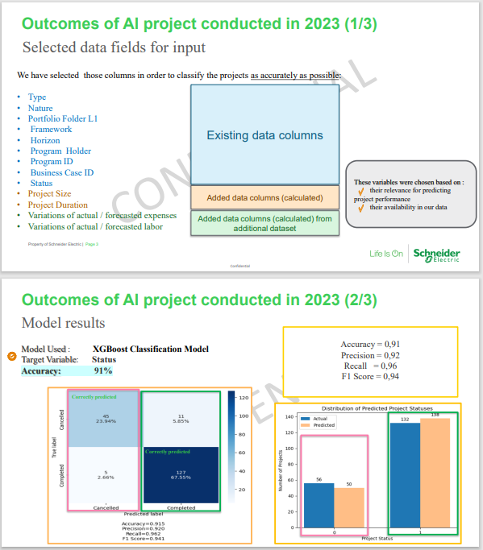

# 📈 Project Risk Prediction (POC)

Prédire les projets **à risque d’annulation/retard** à partir de leurs caractéristiques.  
Ce dépôt montre la **méthodologie** (EDA, préparation, modèles ML) sur un exemple public.
*Aucune donnée confidentielle n’est incluse.*

---

## 🗂 Contenu
- `Data/` – **vide** par design. Utilisez des données **synthétiques/anonymisées** en local.  
  - `Data/README.md` – consignes d’usage  
  - `Data/schemas/` – (optionnel) entêtes de colonnes **sans lignes** pour documenter la structure
- `assets/` – captures (ex. métriques, courbes) à référencer ci-dessous
- `requirements.txt` – dépendances minimales
- (au choix)
  - `notebooks/Code_source_main_public.ipynb` **ou**
  - `notebooks/Code_source_main_public.py`

---

## ⚙️ Installation
```bash
python -m venv .venv && source .venv/bin/activate   # Windows: .venv\Scripts\activate
pip install -r requirements.txt
```

## ▶️ Exécution
- **Notebook** :
  ```bash
  jupyter lab
  ```
  Ouvrez `notebooks/Code_source_main.ipynb` puis remplacez localement le chemin de données :
  ```python
  DATA_PATH = "Data/sample_projects.csv"   # fichier synthétique/anonymisé (local)
  # df = pd.read_csv(DATA_PATH)
  ```

- **Script .py** :
  ```bash
  python notebooks/Code_source_main_public.py
  ```

---

## 🧠 Méthodologie (vue d’ensemble)
- **EDA** : distributions, corrélations, compréhension des variables  
- **Préparation** : nettoyage, encodage, (optionnel) imputation  
- **Modèles testés** : Random Forest, SVM, AdaBoost, XGBoost *(+ SMOTE si classe minoritaire)*  
- **Évaluation** : accuracy, precision, recall, F1, matrice de confusion, feature importance

---

## 📸 Résultats (POC)
Ajoutez vos images dans `assets/` puis référencez-les :

**Model XGBOOST**  



---

## 🔒 Données
Ce dépôt **n’inclut aucune donnée réelle**.  
- Placez en local des fichiers **synthétiques/anonymisés** dans `Data/`.  
- Les fichiers de `Data/` sont ignorés par git (voir `.gitignore`).  
- (Optionnel) Fournissez des **schémas** d’entêtes dans `Data/schemas/` pour documenter les colonnes attendues.

---

## 👩‍💻 Auteur
**Selma Makhlouf** — Data Scientist & Engineer (NLP & Generative AI)  
[LinkedIn](https://www.linkedin.com/in/salma-makhlouf)

